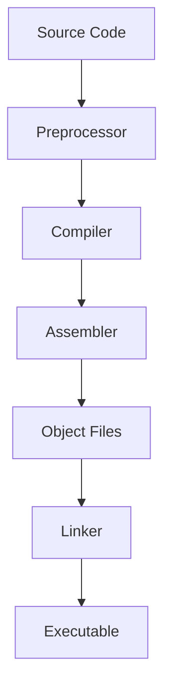

# Documentation Standards

## Writing Principles

All documentation in this repository adheres to professional technical writing standards designed for clarity, reproducibility, and educational value.

### Core Principles

**Clarity**
- Use precise technical terminology
- Define acronyms on first use
- Avoid ambiguous language
- Structure information hierarchically

**Reproducibility**
- Include all version information
- Document environmental dependencies
- Provide complete command sequences
- Specify expected outputs

**Accuracy**
- Verify all procedures before documentation
- Include error cases and troubleshooting
- Cite authoritative sources
- Update documentation with corrections

**Professionalism**
- Maintain formal technical tone
- Focus on factual information
- Avoid colloquialisms and informal language
- Use consistent terminology

## Document Structure

### Research Notes

```markdown
# [Topic Title]

**Date**: YYYY-MM-DD
**Author**: [Name]
**Status**: [Draft | Review | Final]

## Abstract

Brief summary of the research topic and findings.

## Background

Context and prerequisite knowledge.

## Objectives

Clear statement of research goals.

## Procedure

Step-by-step methodology.

## Results

Empirical observations and data.

## Analysis

Interpretation of results.

## Conclusions

Key findings and implications.

## References

Cited sources in standard format.
```

### Technical Procedures

```markdown
# [Procedure Title]

## Overview

Brief description of the procedure purpose.

## Prerequisites

- Required hardware
- Software versions
- Prior knowledge

## Environment

- Operating system: [name and version]
- Toolchain: [version]
- Target platform: [specifications]

## Steps

1. First action
   - Sub-steps if needed
   - Expected output

2. Second action
   ```bash
   command with options
   ```

## Verification

How to confirm successful completion.

## Troubleshooting

Common issues and solutions.

## References

Related documentation and sources.
```

### Experiment Reports

```markdown
# [Experiment Title]

**Date**: YYYY-MM-DD
**Hypothesis**: [Statement]
**Platform**: [Hardware/software]

## Setup

Detailed configuration.

## Methodology

Experimental procedure.

## Data

| Metric | Value | Unit |
|--------|-------|------|
| ...    | ...   | ...  |

## Analysis

Statistical or qualitative analysis.

## Conclusions

Findings and implications.
```

## Formatting Standards

### Headings

- Use ATX-style headers (`#` syntax)
- One H1 per document (title)
- Hierarchical structure (no skipped levels)
- Blank lines before and after headings

### Code Blocks

- Always specify language for syntax highlighting
- Include context (file paths, environment)
- Comment complex operations
- Show expected output when relevant

### Lists

- Blank lines before and after lists
- Consistent bullet style within document
- Ordered lists for sequential steps
- Unordered lists for non-sequential items

### Tables

- Use for structured data
- Include headers
- Align columns consistently
- Keep readable in plain text

### Links

- Descriptive link text (not "click here")
- Prefer relative paths for internal links
- Include URL modification dates for external resources
- Verify links periodically

## Technical Writing Guidelines

### Command Documentation

When documenting commands:

```bash
# Always show the full command with context
cd /path/to/directory
make ARCH=arm CROSS_COMPILE=arm-linux-gnueabihf-

# Include expected output
# Output:
#   CC    main.o
#   LD    program
```

### Version Information

Always specify versions:

```
Software: GCC 11.2.0
Kernel: Linux 5.15.0-LTS
Host: Ubuntu 22.04 LTS
Target: ARM Cortex-A53
```

### Error Documentation

Document errors completely:

```
Error encountered:
  make: *** No rule to make target 'install'. Stop.

Cause:
  Missing installation target in Makefile

Solution:
  Add install target or use manual installation procedure
```

## Code Documentation

### Inline Comments

```c
/* Initialize hardware timer for 1ms tick
 * Clock source: HCLK/8 (9MHz)
 * Prescaler: 9000 for 1kHz
 */
void timer_init(void) {
    // Register configuration
    TIM2->PSC = 8999;  // Prescaler value
    TIM2->ARR = 999;   // Auto-reload for 1ms
}
```

### Function Documentation

```c
/**
 * @brief Read data from I2C device
 * 
 * @param dev_addr Device I2C address (7-bit)
 * @param reg_addr Register address to read
 * @param buffer Pointer to data buffer
 * @param length Number of bytes to read
 * 
 * @return 0 on success, negative error code on failure
 * 
 * @note This function blocks until transfer completes
 * @warning Buffer must be at least 'length' bytes
 */
int i2c_read(uint8_t dev_addr, uint8_t reg_addr, 
             uint8_t *buffer, size_t length);
```

## Diagrams and Visualizations

### ASCII Diagrams

For simple system diagrams:

```
┌─────────────┐     ┌──────────────┐
│  Bootloader │ --> │ Linux Kernel │
│   (U-Boot)  │     │   (zImage)   │
└─────────────┘     └──────────────┘
       │                    │
       v                    v
┌─────────────┐     ┌──────────────┐
│ Device Tree │     │ Root FS      │
│   (.dtb)    │     │ (initramfs)  │
└─────────────┘     └──────────────┘
```

### Mermaid Diagrams

For complex flows, use Mermaid:



## File Naming

### Documentation Files

- Use lowercase with hyphens: `cross-compilation-guide.md`
- Descriptive names: `beagleplay-uart-configuration.md`
- Date prefix for logs: `2025-11-23-build-log.md`

### Code Files

- Follow language conventions
- C files: `lowercase_with_underscores.c`
- Headers: `lowercase_with_underscores.h`
- Scripts: `lowercase-with-hyphens.sh`

### Configuration Files

- Preserve standard names: `.config`, `Makefile`, `CMakeLists.txt`
- Custom configs: descriptive names with extension
- Example: `kernel-5.15-beagleplay.config`

## Review Process

### Self-Review Checklist

Before committing documentation:

- [ ] All commands tested and verified
- [ ] Version information included
- [ ] Links checked and valid
- [ ] Code blocks have language specified
- [ ] Spelling and grammar checked
- [ ] Consistent terminology used
- [ ] References properly cited
- [ ] Procedures are reproducible

## Maintenance

### Documentation Updates

- Update dates when content changes
- Track version history in git
- Mark deprecated content clearly
- Archive obsolete documentation

### Periodic Review

- Quarterly review of all documentation
- Verify external links
- Update version information
- Incorporate feedback and corrections

---

**Document Version**: 1.0

**Last Updated**: November 2025
